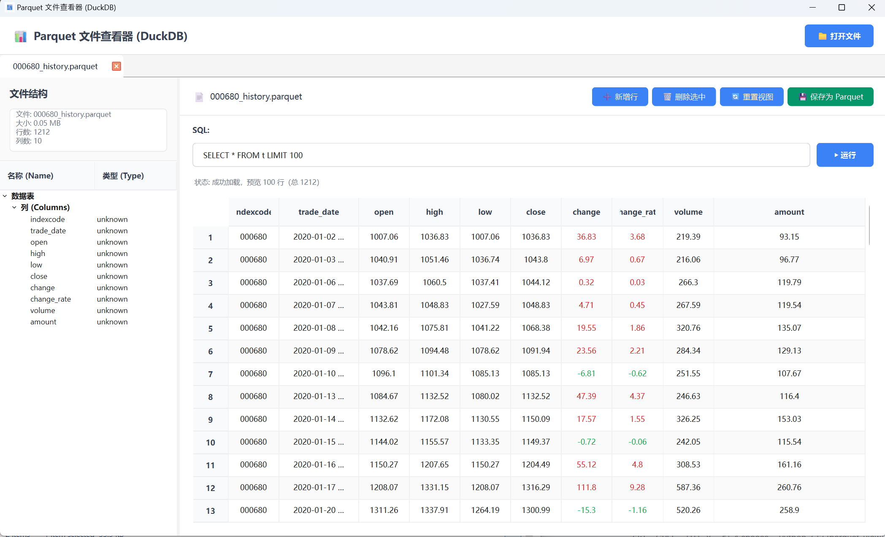

ParquetViewer — A Lightweight Parquet Viewer (DuckDB + PyQt6)

🚀 Instantly open, browse, edit and query .parquet files — without pandas or Python environment.

📌 Overview

ParquetViewer is a lightweight desktop application for quickly viewing and querying Parquet files locally.
Powered by DuckDB and PyQt6, it provides:

⚡ Faster loading than pandas / pyarrow

🧪 Built-in SQL query

📝 Excel-like table editing

🧰 Standalone EXE packaging (no Python required)

Ideal for:

Quant researchers

Data analysts / data engineers

ML practitioners

Anyone dealing with large .parquet datasets

Main Interface

SQL Query Example

✨ Features
🏃‍♂️ Fast & Lightweight

Uses DuckDB for instant Parquet scanning

Zero pandas dependency

Low memory footprint

🔍 Excel-like UI

View Parquet tables in a clean grid

Scroll, sort, inspect columns

📝 Editable Table

Edit cell values

Add rows

Delete rows

Save modifications back to a Parquet file

🧩 SQL Query (DuckDB)

Supports:

SELECT *
FROM table
WHERE column > 10
LIMIT 100;

📂 Multi-Tab File Viewer

Open multiple Parquet files at the same time.

🪟 System File Association

Double-click .parquet files → open directly in ParquetViewer.

📦 Portable EXE

Built with PyInstaller

Compressed with UPX

Final EXE: ~30–40 MB

🛠️ Tech Stack
Component	Purpose
PyQt6	GUI
DuckDB	In-memory SQL engine for fast Parquet access
PyInstaller	Generate standalone EXE
UPX	Binary compression
Pillow	Generate .ico application icon
📥 Download

Download the latest release (EXE):

👉 https://github.com/yourusername/ParquetViewer/releases

🚀 How to Use

Open ParquetViewer.exe

Drag or double-click .parquet files

Browse & edit

Run SQL queries

Save modified data

💻 Run from Source
1. Clone
git clone https://github.com/yourusername/ParquetViewer.git
cd ParquetViewer

2. Install dependencies
pip install -r requirements.txt

3. Launch the application
python parquet_viewer_duckdb.py

🧩 Core Code Structure
├── parquet_viewer_duckdb.py   # Main UI & logic
├── build_slim.py              # Packaging script
├── app.png / app.ico          # Application icon
├── associate_parquet_user.reg # Windows file association
└── README.md                  # Documentation

🧱 Architecture
PyQt6 UI
   │
   ├── QTableWidget       → Data display + editing
   ├── QTabWidget         → Multi-file support
   └── SQL input box      → Run SQL queries
          │
          ▼
DuckDB ───────────→ read_parquet()  (no pandas)
          │
          ▼
DataFrame → populate widget

📦 Build (EXE Packaging)

Use the slim builder:

python build_slim.py

It will:

✔ Generate icon
✔ Embed version info
✔ Run PyInstaller
✔ Compress with UPX
✔ Output final EXE in /dist/ParquetViewer

🪟 File Association (Optional)

Double-click .parquet in Windows to auto-open with the viewer.

Run:

associate_parquet_user.reg

🗺️ Roadmap

 Dark mode

 Column filtering & sorting

 Large-file streaming mode

 SQLite/CSV support

 Fuzzy search & column statistics

🤝 Contributing

PRs and feature suggestions are welcome!
If you like this tool, please ⭐ star the repo to support the project.

📄 License

MIT License — free for personal and commercial use.